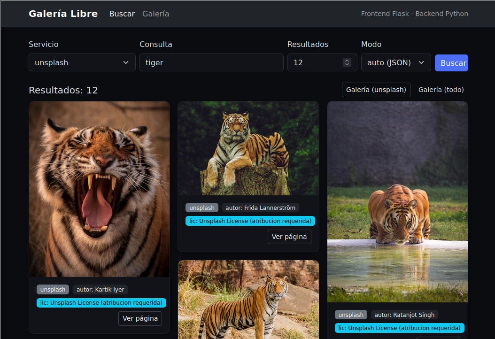

# Proyecto: Exploración de Bancos de Imágenes (APIs) – Backend y Frontends en Python



## 1) Descripción y motivación
Este proyecto es un **ejemplo docente** para enseñar:
- Qué es una **API HTTP** y cómo consumirla desde Python.
- Cómo modelar un **backend** reutilizable con **clases** y subclases para distintos proveedores (Unsplash, Pexels, Pixabay, Openverse, Wikimedia).
- Cómo construir **frontends** que reutilicen el backend: **CLI**, **web con Streamlit** y **web con Flask**.
Motivación: practicar **registro y autenticación** (API keys, OAuth2), **buenas prácticas** (gestión de secretos, `User-Agent`, licencias) y **diseño POO** (clase base + adaptadores).

---

## 2) Puesta en marcha (configuración inicial)
### Archivos clave
- `bancos_imagenes.json` → **config pública** por servicio: `base_url`, `client_id`, `user_agent`, `dry`, etc.
- `SECRETOS` → **variables de entorno** (no subir a Git): API keys y *client_secret*.
  - Linux/macOS: `./export_env.sh` (o `source SECRETOS` si ya lo usas tú).
  - PowerShell/Windows: `./export_env.ps1` (lee el mismo formato `KEY=VALUE` o `export KEY=VALUE`).

> **Importante sobre `dry`:**  
> - En `bancos_imagenes.json` cada servicio tiene `"dry": true|false`.  
> - `dry=true` **no llama a Internet**; solo construye **URL/headers/parámetros** (ideal para clase y depuración).  
> - Puedes anularlo en CLI/Frontends con un selector/flag.

### Ejemplo de `bancos_imagenes.json` (fragmento)
```json
{
  "unsplash": {
    "base_url": "https://api.unsplash.com",
    "access_key_env": "UNSPLASH_KEY",
    "dry": false
  },
  "openverse": {
    "base_url": "https://api.openverse.org",
    "client_id": "TU_CLIENT_ID",
    "client_secret_env": "OPENVERSE_CLIENT_SECRET",
    "dry": false
  },
  "wikimedia": {
    "base_url": "https://commons.wikimedia.org/w/api.php",
    "user_agent": "victor (mailto:vicgarpe@uchceu.es)",
    "dry": false
  }
}
```

### Ejemplo de `SECRETOS`
```bash
# Linux/macOS
export UNSPLASH_KEY="..."
export PEXELS_KEY="..."
export PIXABAY_API_KEY="..."
export OPENVERSE_CLIENT_SECRET="..."
```
```powershell
# Windows (PowerShell)
$env:UNSPLASH_KEY = "..."
$env:PEXELS_KEY = "..."
$env:PIXABAY_API_KEY = "..."
$env:OPENVERSE_CLIENT_SECRET = "..."
```

---

## 3) Entorno virtual + dependencias
Se recomienda trabajar en un **entorno virtual** y usar `requirements.txt`.

```bash
python3 -m venv .venv
source .venv/bin/activate             # (Windows: .venv\Scripts\activate)
pip install -r requirements.txt
```

**requirements.txt (sugerido):**
```
requests
streamlit
flask
```

---

## 4) Frontends disponibles
Todos reutilizan el backend (`modulos/bancos_imagenes.py`) y guardan miniaturas en `./descargas/<servicio>/`.

### A) CLI (consola) – `app.py`
```bash
python3 app.py --servicio unsplash --query gato --per-page 6
# opciones: --json bancos_imagenes.json  --dry-run auto|true|false
```

### B) Frontend web con **Streamlit** – `frontend_streamlit.py`
```bash
streamlit run frontend_streamlit.py
# Interfaz con búsqueda, modos (dry/real) y botón “Generar galería HTML” (preview embebido)
```

### C) Frontend web con **Flask** – `app_web.py`
```bash
python app_web.py
# Abre http://127.0.0.1:5000/
# “Buscar” (mosaico responsive) y “Galería” (HTML auto-generado con tema dark en un iframe)
```
Rutas útiles en Flask:
- `/` – buscador (mosaico).
- `/galeria` – galería embebida oscura.
- `/galeria_raw?service=unsplash` – HTML de galería directo.
- `/descargas/<path>` – sirve las imágenes descargadas.

> Nota: en **Streamlit**, el preview de la galería usa **Data URIs** para que se vean las imágenes embebidas en el iframe.  
> En **Flask**, servimos `/descargas/...` para que el HTML apunte a ficheros reales, ligero y escalable.

---

## 5) ¡A disfrutar!
Este repositorio es un punto de partida. Te animamos a:
- Añadir **paginación**, filtros por **licencia**, **tamaño**, etc.
- Mejorar **caché**, **backoff** ante *rate limit* y tests.
- Crear más **frontends** (FastAPI + HTMX, escritorio con PySide, etc.).  
¡Disfruta codificando y **lleva la app más allá** en frontend, backend o en ambos!
